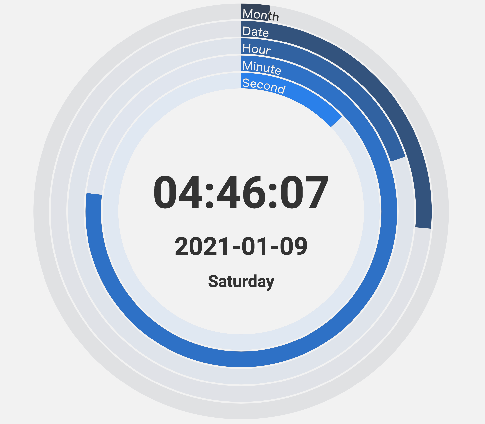

# WariClo

## これは何？

ドーナツ型のアナログ時計とデジタル時計のサイトのソースです。



## 開発

ローカルで試すには、

```sh
docker-compose up
```

して，[localhost:3001](http://localhost:3001/)を開くといいと思います。

VSCode で開発するなら [Remote Containers](https://code.visualstudio.com/docs/remote/containers) の設定はしてあるので、楽に始められると思います。

## いろいろリンク

### サイト

[実際のサイトはここ](https://wariclo.nimon.dev/)

### プロトタイプ（Figma）

- [プロトタイプ編集画面（編集はできないよ）](https://www.figma.com/file/zl0ihnkAH6VYWpeUDUBd3e/PC?node-id=0%3A1)
- [プロトタイプ実行画面](https://www.figma.com/proto/zl0ihnkAH6VYWpeUDUBd3e/PC?node-id=53%3A1836&scaling=min-zoom)
